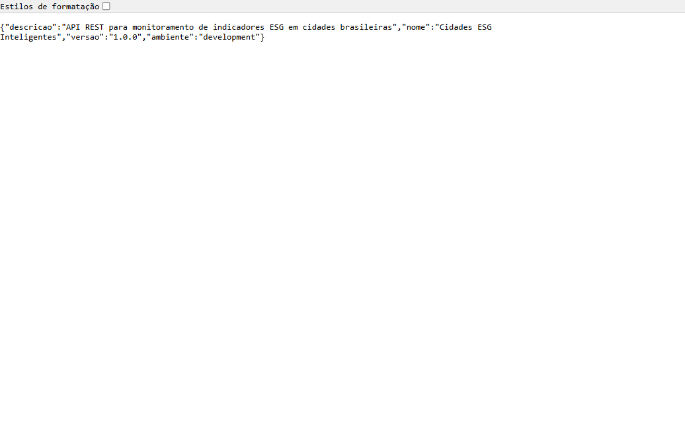
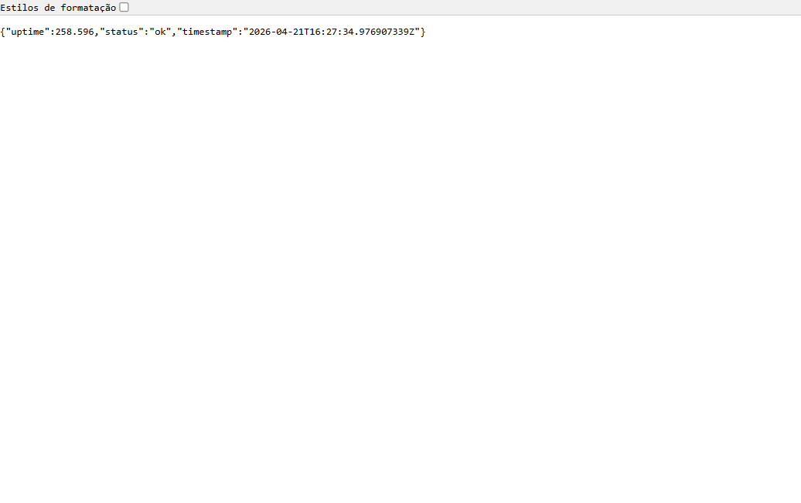
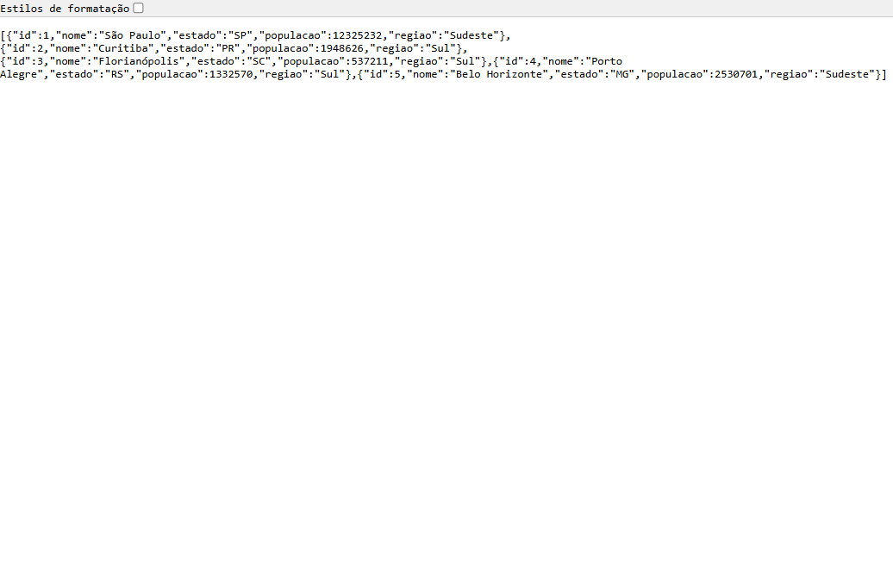
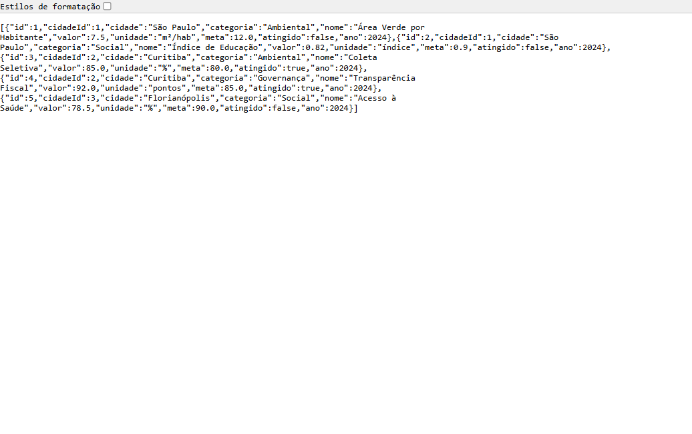
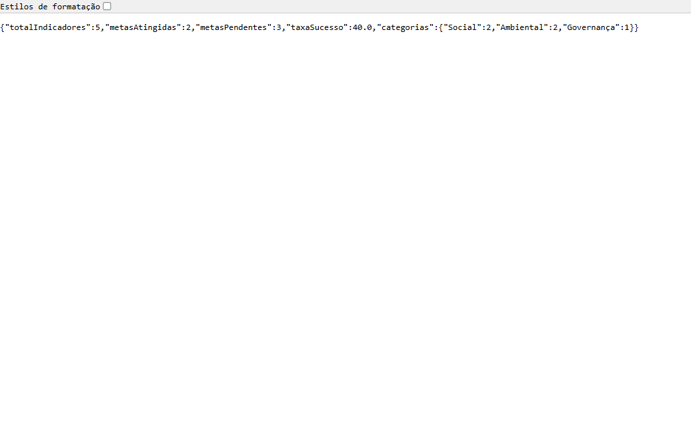
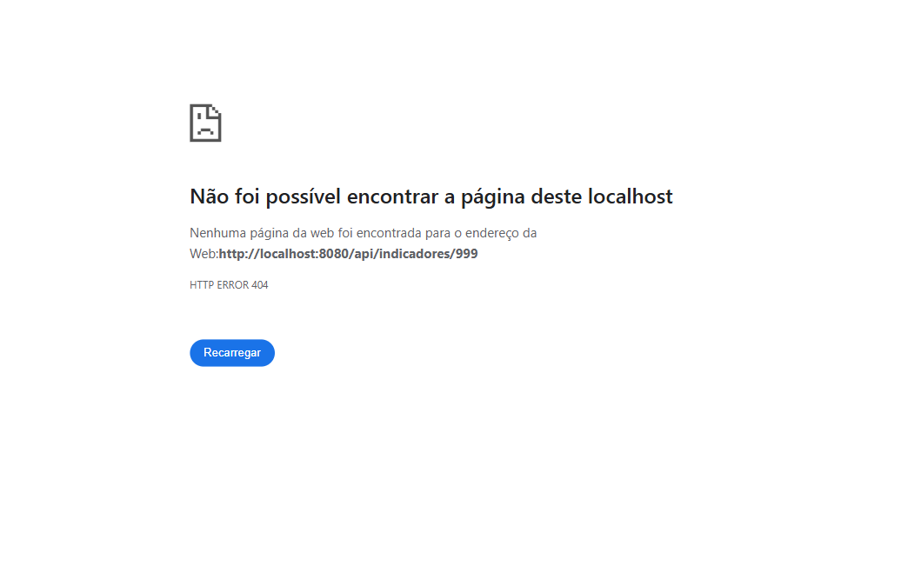
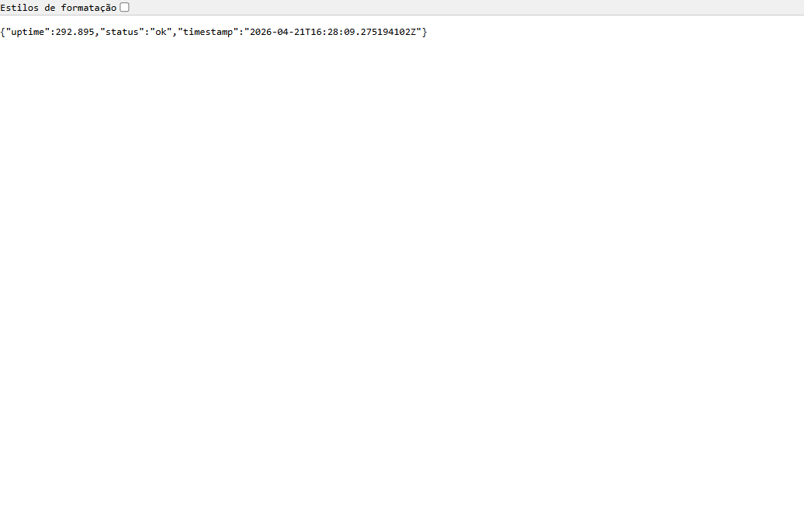
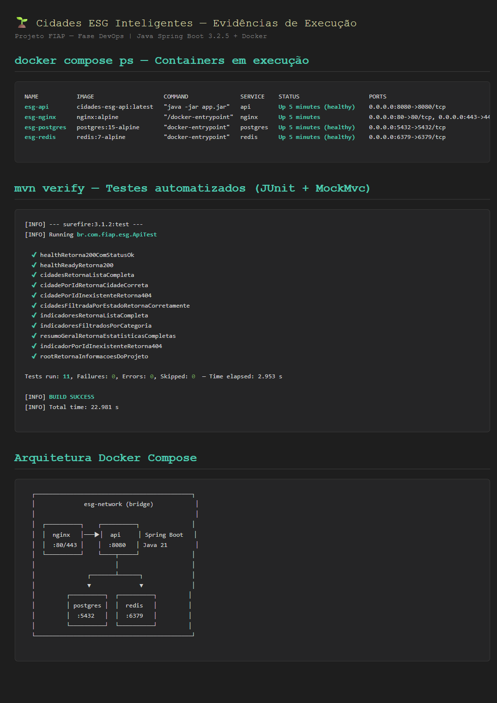
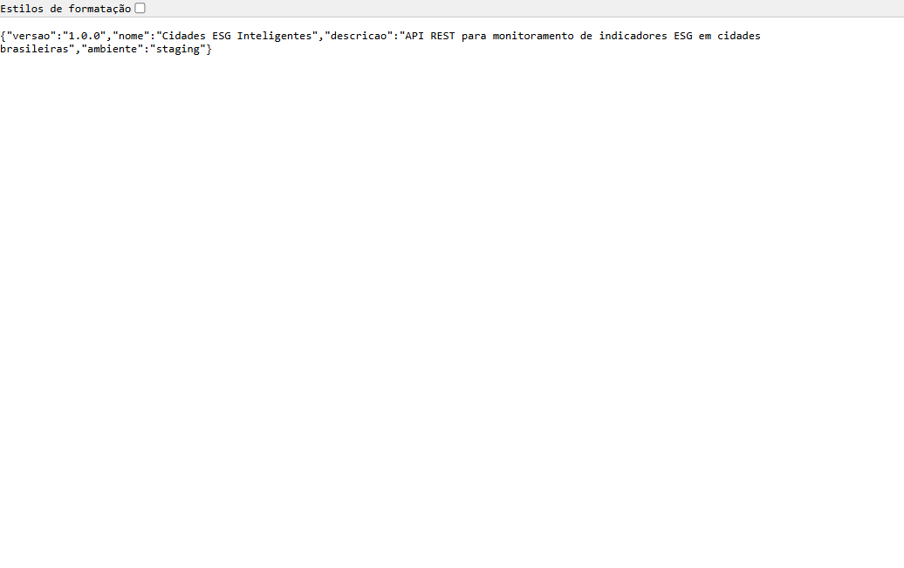

# Projeto - Cidades ESG Inteligentes

> API REST para monitoramento de indicadores ESG (Environmental, Social & Governance) em cidades brasileiras — construída com Java Spring Boot, containerizada com Docker e com pipeline CI/CD completo via GitHub Actions.


---

## Grupo 118 — Integrantes

| Nome | E-mail |
|------|--------|
| Natália de Oliveira Santos | natalia.o.santos.00@gmail.com |
| Gabriel dos Santos Souza | gabriel292603@gmail.com |
| Thomas Henrique Baúte | baute.thomas25@gmail.com |
| Bruno Mateus Tizer das Chagas | brunotizer@icloud.com |
| Felipe Olecsiuc Damasceno | patcho.olec@gmail.com |

---

## Índice

- [Como executar localmente com Docker](#como-executar-localmente-com-docker)
- [Pipeline CI/CD](#pipeline-cicd)
- [Containerização](#containerização)
- [Prints do funcionamento](#prints-do-funcionamento)
- [Tecnologias utilizadas](#tecnologias-utilizadas)
- [Checklist de entrega](#checklist-de-entrega)

---

## Como executar localmente com Docker

### Pré-requisitos

- Docker >= 24.0
- Docker Compose >= 2.20
- Git

### Passo a passo

**1. Clone o repositório e entre na pasta**
```bash
git clone <url-do-repositorio>
cd cidades-esg-inteligentes
```

**2. Configure as variáveis de ambiente**
```bash
cp .env.example .env
# Edite o .env se quiser ajustar portas, senhas ou secrets
```

**3. Suba todos os serviços**
```bash
docker compose up -d --build
```

Na primeira execução o Maven vai baixar as dependências e executar os 11 testes dentro do container (stage builder do Dockerfile), então leva alguns minutos.

**4. Verifique se os containers estão saudáveis**
```bash
docker compose ps
curl http://localhost:8080/api/health
```

**5. Endpoints disponíveis**
```
GET http://localhost:8080/                               → Info do projeto
GET http://localhost:8080/api/health                     → Health check
GET http://localhost:8080/api/health/ready               → Readiness probe
GET http://localhost:8080/api/cidades                    → Lista de cidades
GET http://localhost:8080/api/cidades/{id}               → Cidade por ID
GET http://localhost:8080/api/cidades?estado=PR          → Filtro por estado
GET http://localhost:8080/api/indicadores                → Lista de indicadores ESG
GET http://localhost:8080/api/indicadores?categoria=X    → Filtro por categoria
GET http://localhost:8080/api/indicadores/{id}           → Indicador por ID
GET http://localhost:8080/api/indicadores/resumo/geral   → Resumo estatístico
```

Tudo também está acessível via **Nginx** em `http://localhost:80` (proxy reverso).

**Comandos úteis**
```bash
# Logs da API
docker compose logs -f api

# Derrubar tudo
docker compose down

# Rebuild forçado
docker compose up -d --build

# Subir com monitoramento (Prometheus + Grafana)
docker compose --profile monitoring up -d

# Ambiente de staging
docker compose -f docker-compose.yml -f docker-compose.staging.yml up -d

# Ambiente de produção
docker compose -f docker-compose.yml -f docker-compose.prod.yml up -d
```

**Executar testes sem Docker (precisa do Maven e Java 21)**
```bash
mvn verify
```

---

## Pipeline CI/CD

### Ferramenta: GitHub Actions

Arquivo: `.github/workflows/ci-cd.yml` — acionado em `push` e `pull_request` nas branches `main`, `develop` e `feature/**`.

### Fluxo do pipeline

```
Push / Pull Request
      │
      ▼
┌───────────────────────────────────────┐
│   JOB 1: Build & Testes (Maven)       │
│   • actions/setup-java (Java 21)      │
│   • mvn verify -B                     │
│     └─ Compila + roda 11 testes JUnit │
│   • Publica relatório surefire (XML)  │
│   • Upload cobertura (Codecov)        │
└───────────────┬───────────────────────┘
                │ sucesso
                ▼
┌───────────────────────────────────────┐
│   JOB 2: Docker Build & Push          │
│   • docker/setup-buildx               │
│   • Login em ghcr.io                  │
│   • Build multi-stage (Maven + JRE)   │
│   • Push com tags: branch, sha, latest│
└───────────────┬───────────────────────┘
                │ branch: develop ou main
                ▼
┌───────────────────────────────────────┐
│   JOB 3: Deploy Staging (SSH)         │
│   • docker compose pull               │
│   • up -d com overrides de staging    │
│   • curl /api/health (smoke test)     │
└───────────────┬───────────────────────┘
                │ sucesso
                ▼
┌───────────────────────────────────────┐
│   JOB 4: Integration Tests - Staging  │
│   • curl em todos endpoints públicos  │
└───────────────┬───────────────────────┘
                │ branch: main
                ▼
┌───────────────────────────────────────┐
│   JOB 5: Deploy Produção (SSH)        │
│   • pg_dump (backup do banco)         │
│   • docker compose up -d (prod)       │
│   • Health check final                │
│   • Cria Release no GitHub            │
└───────────────────────────────────────┘
```

### Secrets necessários no GitHub

| Secret | Descrição |
|--------|-----------|
| `STAGING_HOST` | IP/hostname do servidor de staging |
| `STAGING_USER` | Usuário SSH do staging |
| `STAGING_SSH_KEY` | Chave SSH privada (staging) |
| `STAGING_POSTGRES_PASSWORD` | Senha PostgreSQL em staging |
| `STAGING_JWT_SECRET` | Secret JWT em staging |
| `PROD_HOST` | IP/hostname do servidor de produção |
| `PROD_USER` | Usuário SSH da produção |
| `PROD_SSH_KEY` | Chave SSH privada (produção) |
| `PROD_POSTGRES_PASSWORD` | Senha PostgreSQL em produção |
| `PROD_JWT_SECRET` | Secret JWT em produção |

---

## Containerização

### Estratégia: Multi-stage Build

O `Dockerfile` utiliza **dois estágios** para reduzir o tamanho e aumentar a segurança da imagem final:

```dockerfile
# Stage 1 — Builder: Maven compila + empacota + roda testes
FROM maven:3.9-eclipse-temurin-21-alpine AS builder
WORKDIR /app
COPY pom.xml .
RUN mvn dependency:go-offline -B
COPY src ./src
RUN mvn package -B            # ← Compila e executa os 11 testes JUnit

# Stage 2 — Production: imagem enxuta somente com JRE
FROM eclipse-temurin:21-jre-alpine AS production
RUN addgroup -S appgroup && adduser -S appuser -G appgroup
WORKDIR /app
COPY --from=builder --chown=appuser:appgroup /app/target/*.jar app.jar
USER appuser                  # ← Usuário não-root
EXPOSE 8080
HEALTHCHECK --interval=30s --timeout=10s --start-period=30s --retries=3 \
  CMD wget --no-verbose --tries=1 --spider http://localhost:8080/api/health || exit 1
ENTRYPOINT ["java", "-jar", "app.jar"]
```

### Boas práticas adotadas

| Prática | Implementação |
|---------|--------------|
| Multi-stage build | Imagem final só com JRE, sem Maven ou fontes |
| Usuário não-root | `adduser appuser` no stage production |
| Health check nativo | `HEALTHCHECK` no Dockerfile + `healthcheck` no compose |
| Cache de dependências | `mvn dependency:go-offline` antes de copiar o `src/` |
| Imagem mínima | `eclipse-temurin:21-jre-alpine` (~200 MB final) |
| Testes obrigatórios no build | `mvn package` executa os testes — build falha se algum teste falhar |

### Serviços no Docker Compose

| Serviço | Imagem | Porta | Função |
|---------|--------|-------|--------|
| `api` | build local (Spring Boot) | 8080 | API REST Java |
| `postgres` | postgres:15-alpine | 5432 | Banco de dados |
| `redis` | redis:7-alpine | 6379 | Cache |
| `nginx` | nginx:alpine | 80 / 443 | Reverse proxy |
| `prometheus` | prom/prometheus | 9090 | Métricas (perfil `monitoring`) |
| `grafana` | grafana/grafana | 3001 | Dashboards (perfil `monitoring`) |

### Recursos do Compose utilizados

- **Volumes nomeados:** `esg-postgres-data`, `esg-redis-data`, `esg-prometheus-data`
- **Rede bridge dedicada:** `esg-network`
- **Variáveis de ambiente:** carregadas do `.env` com defaults seguros no compose
- **Healthchecks:** PostgreSQL, Redis e API aguardam ficar saudáveis antes de subir dependentes
- **Overrides por ambiente:** `docker-compose.staging.yml` (2 réplicas) e `docker-compose.prod.yml` (3 réplicas + resource limits)

---

## Prints do funcionamento

### 1. Endpoint raiz `GET /`


### 2. Health check `GET /api/health`


### 3. Lista de cidades `GET /api/cidades`


### 4. Indicadores ESG `GET /api/indicadores`


### 5. Resumo estatístico `GET /api/indicadores/resumo/geral`


### 6. Tratamento de erro — HTTP 404 para ID inexistente


### 7. Acesso via Nginx (reverse proxy porta 80)


### 8. Containers saudáveis + 11 testes passando + arquitetura


### 9. Ambiente de Staging — `SPRING_PROFILES_ACTIVE=staging`
> Execução com `docker compose -f docker-compose.yml -f docker-compose.staging.yml up -d` — `ambiente: staging` retornado pela API.



### 10. Ambiente de Produção — `SPRING_PROFILES_ACTIVE=production`
> Execução com `docker compose -f docker-compose.yml -f docker-compose.prod.yml up -d` — `ambiente: production` retornado pela API.


### Resultado da suite de testes (Maven Surefire)

```
[INFO] --- surefire:3.1.2:test (default-test) @ cidades-esg-inteligentes ---
[INFO] Running br.com.fiap.esg.ApiTest

  ✔ healthRetorna200ComStatusOk
  ✔ healthReadyRetorna200
  ✔ cidadesRetornaListaCompleta
  ✔ cidadePorIdRetornaCidadeCorreta
  ✔ cidadePorIdInexistenteRetorna404
  ✔ cidadesFiltradaPorEstadoRetornaCorretamente
  ✔ indicadoresRetornaListaCompleta
  ✔ indicadoresFiltradosPorCategoria
  ✔ resumoGeralRetornaEstatisticasCompletas
  ✔ indicadorPorIdInexistenteRetorna404
  ✔ rootRetornaInformacoesDoProjeto

Tests run: 11, Failures: 0, Errors: 0, Skipped: 0 — Time elapsed: 2.953 s
[INFO] BUILD SUCCESS
```

---

## Tecnologias utilizadas

| Categoria | Tecnologia | Versão |
|-----------|-----------|--------|
| **Linguagem** | Java | 21 |
| **Framework** | Spring Boot | 3.2.5 |
| **Build** | Maven | 3.9 |
| **Testes** | JUnit 5 + Spring MockMvc | 5.x |
| **Containerização** | Docker | 24+ |
| **Orquestração** | Docker Compose | v3.9 |
| **CI/CD** | GitHub Actions | - |
| **Banco de Dados** | PostgreSQL | 15-alpine |
| **Cache** | Redis | 7-alpine |
| **Proxy Reverso** | Nginx | alpine |
| **Monitoramento** | Prometheus + Grafana | latest |
| **Registry** | GitHub Container Registry (ghcr.io) | - |
| **Base OS** | Alpine Linux (Eclipse Temurin JRE 21) | - |

---

## Checklist de Entrega

| Item | Status |
|------|--------|
| Projeto compactado em .ZIP com estrutura organizada | ✅ |
| Dockerfile funcional (multi-stage Java/Maven) | ✅ |
| docker-compose.yml com todos os serviços + overrides de staging e produção | ✅ |
| Pipeline CI/CD com build, teste e deploy em 2 ambientes | ✅ |
| README.md com instruções e prints | ✅ |
| Documentação técnica (PDF) | ✅ |
| Deploy configurado para staging e produção | ✅ |
